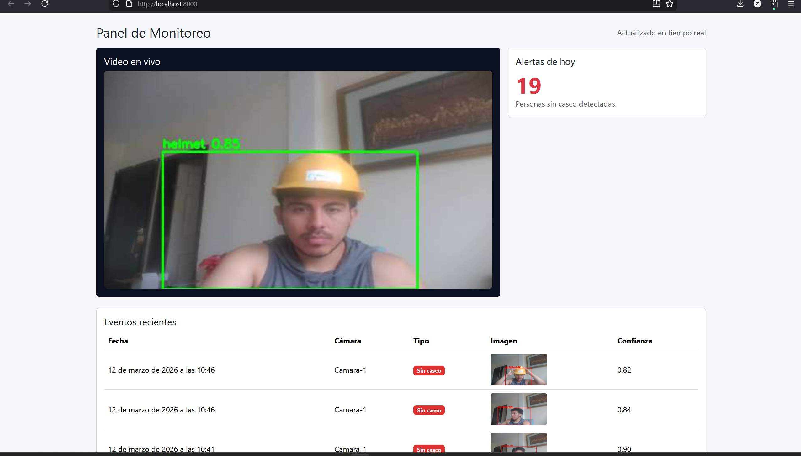
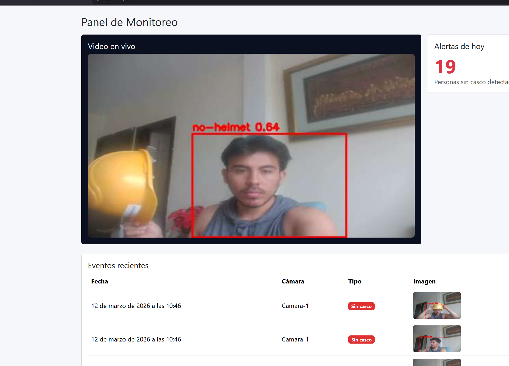
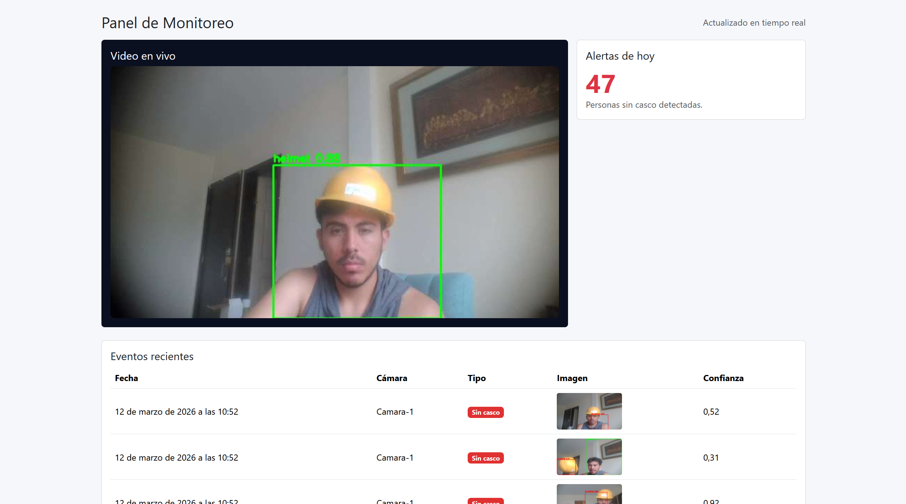
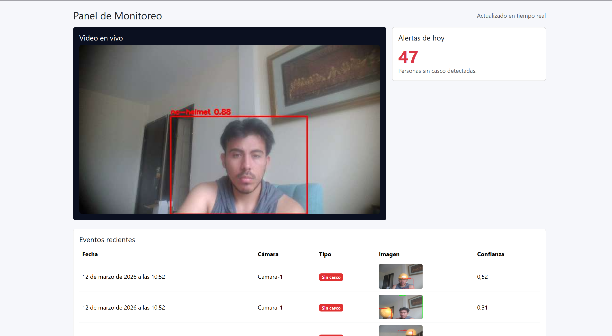

# 🦺 Sistema de Monitoreo de Casco con Vision por Computadora (Django + YOLOv8)

Sistema completo de seguridad industrial para detectar personas con y sin casco en tiempo real, registrar evidencias y visualizar alertas en un dashboard web.

---

## ✅ Descripcion

Plataforma de monitoreo que captura video desde webcam o camara IP (RTSP), ejecuta deteccion con YOLOv8, dibuja bounding boxes, registra eventos en PostgreSQL y muestra todo en un dashboard en vivo usando MJPEG.

### ¿Que hace este proyecto?

- **Captura de video**: desde webcam local o camara IP (RTSP)
- **Deteccion**: persona, casco, sin casco
- **Streaming MJPEG**: video en vivo en el navegador
- **Eventos**: guarda alertas en PostgreSQL con evidencia (imagen)
- **Dashboard**: lista de eventos, contador diario y visualizacion de evidencia

---

## ✨ Caracteristicas Principales

| Caracteristica | Descripcion |
|----------------|-------------|
| **Deteccion en tiempo real** | YOLOv8 con bounding boxes y colores (verde/rojo) |
| **Dashboard web** | Panel en Bootstrap con stream, metricas y eventos |
| **API REST** | Endpoints para listar y crear eventos |
| **Evidencia** | Imagenes guardadas en `media/` |
| **Dockerizado** | Docker + Compose listo para produccion |
| **Escalable** | Soporta camaras RTSP y multiples instancias de detector |

---

## 🧰 Stack Tecnologico

- **Python 3.11**
- **Django 5 + DRF**
- **PostgreSQL**
- **OpenCV + Ultralytics YOLOv8**
- **HTML5 + Bootstrap 5 + JS**
- **Docker + Docker Compose**

---

## ⚙️ Arquitectura

Separacion clara de servicios:

1. **Detector IA** (servicio independiente)
2. **Backend Django** (API + Dashboard + Streaming)
3. **PostgreSQL** (eventos)
4. **Frontend** integrado en Django

---

## ✅ Instalacion y Uso

### Requisitos

- Docker Desktop
- (Opcional) Python 3.11 para ejecutar el detector local en Windows

### Levantar con Docker

```bash
docker compose up --build
```

Abre:
- **Dashboard**: `http://localhost:8000`
- **Stream MJPEG**: `http://localhost:8000/stream/`

---

## ✅ Modo Webcam Local (Windows)

En Windows, la webcam dentro de Docker puede ser inestable. Para mejor rendimiento, se usa:

**Backend + DB en Docker** y **Detector local en Windows**.

1. Levanta web + DB:
```bash
docker compose up -d postgres web redis
```

2. Ejecuta el detector local:
```powershell
C:\Users\Nabetse\Downloads\casco\MonoBleedingEdge\detector\run_local.ps1
```

---

## ✅ Variables de Entorno Clave

Archivo `.env`:

- `CAMERA_URL` → `0` para webcam / RTSP para IP
- `MODEL_PATH` → ruta del modelo (ej: `/app/models/best.pt`)
- `EVENT_THROTTLE_SECONDS` → evita duplicados
- `FRAME_WIDTH/HEIGHT` → rendimiento vs precision
- `INFER_EVERY` → frecuencia de inferencia
- `USE_OPENVINO` → acelera en Intel iGPU

---

## 🧠 Deteccion de Casco (Modelo)

El modelo COCO base **no detecta casco**. Por eso se usa un modelo especializado.

En este proyecto se integra:

- `models/best.pt` → modelo entrenado con clase `helmet`
- `yolov8n.pt` → usado solo para detectar personas

Se hace **asociacion casco ↔ cabeza** para reducir falsos positivos (pelo, sombras, etc.).

---

## ✅ Optimizacion (Tiempo real)

Para lograr fluidez y precision:

- Captura en hilo separado (FrameGrabber)
- Inferencia asincrona
- Reduccion de resolucion
- Asociacion casco-persona por zona de cabeza
- Filtros de tamaño minimo de casco
- Watchdog anti-congelamiento de camara
- OpenVINO opcional para Intel Iris Xe

---

## 🧪 API REST

- `GET /api/eventos/` → lista eventos
- `POST /api/eventos/` → crea evento

---

## 📁 Estructura del Proyecto

```
project/
├── docker-compose.yml
├── .env
├── docs/
│   └── evidence/
├── backend/
│   ├── Dockerfile
│   ├── manage.py
│   ├── config/
│   └── monitoreo/
├── detector/
│   ├── Dockerfile
│   ├── detector.py
│   ├── run_local.ps1
│   └── requirements.txt
├── media/
├── models/
└── README.md
```

---

## 🖼️ Evidencias

Capturas reales del sistema en funcionamiento:

[Image #1]









---

## 🧑‍💻 Desarrollado para Produccion

Sistema preparado para escalar por camaras y adaptarse a entornos industriales.

---

© 2026 - Sistema de Monitoreo de Casco. Todos los derechos reservados.